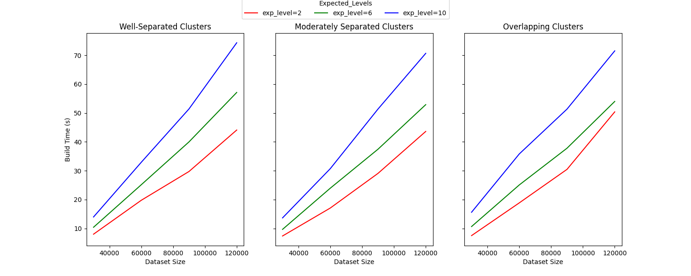
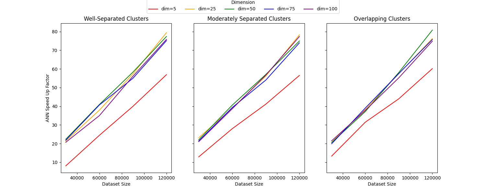
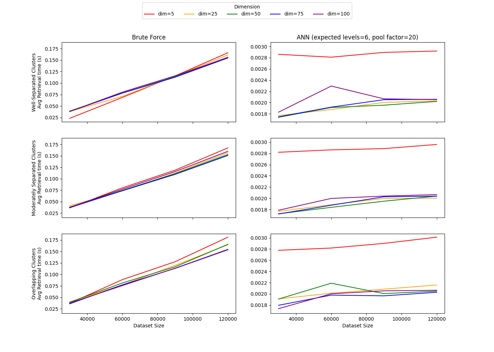
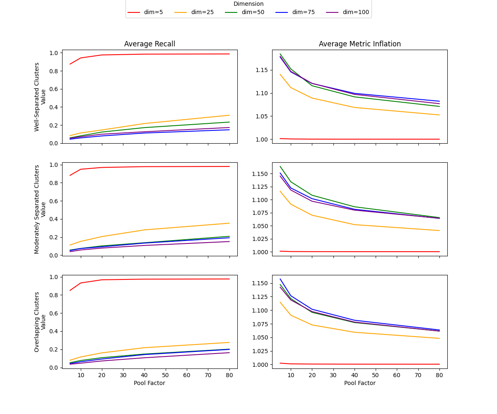
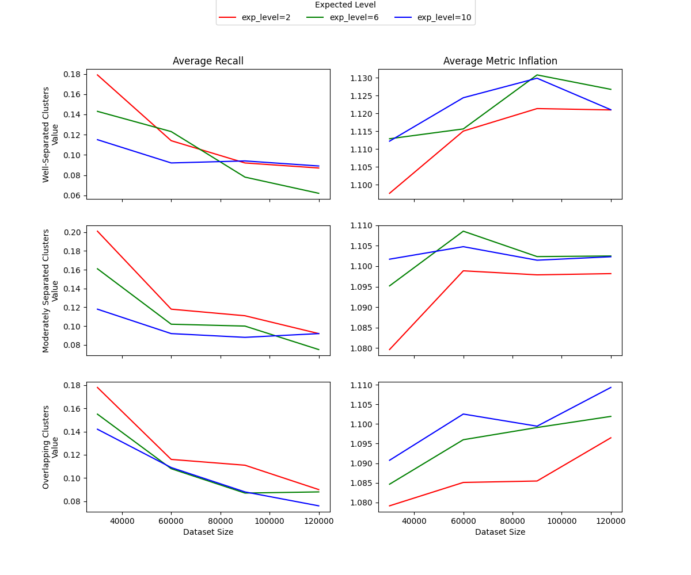
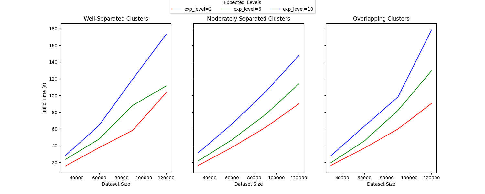
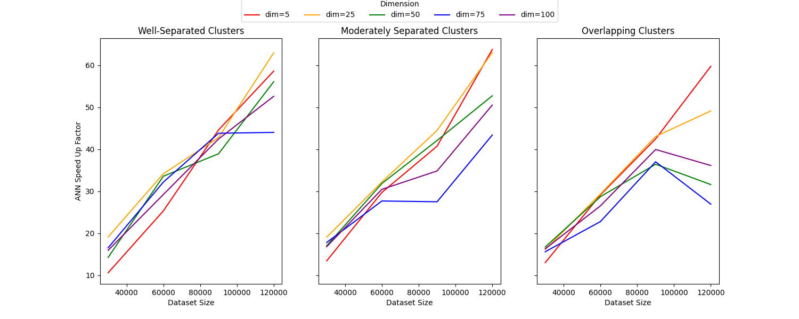
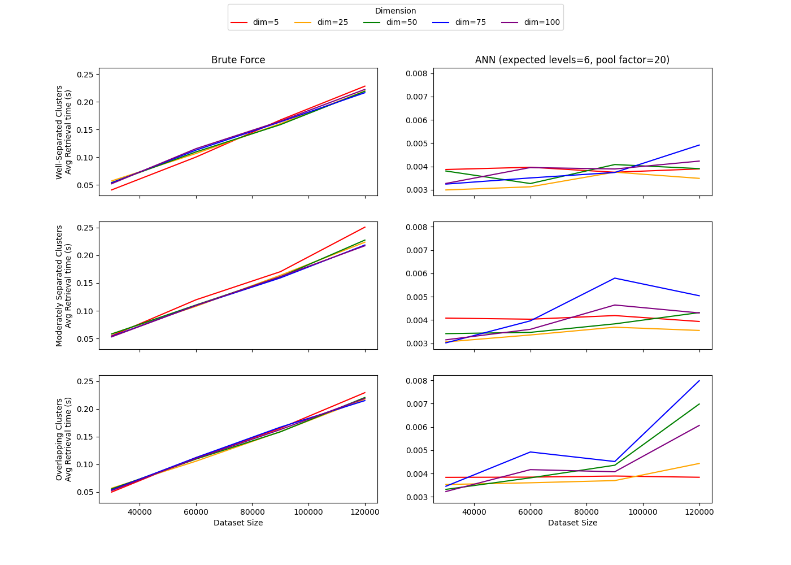
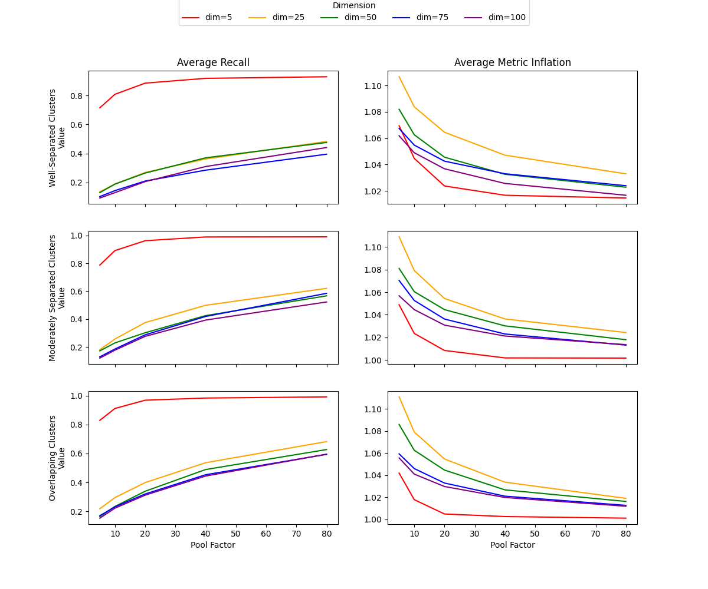
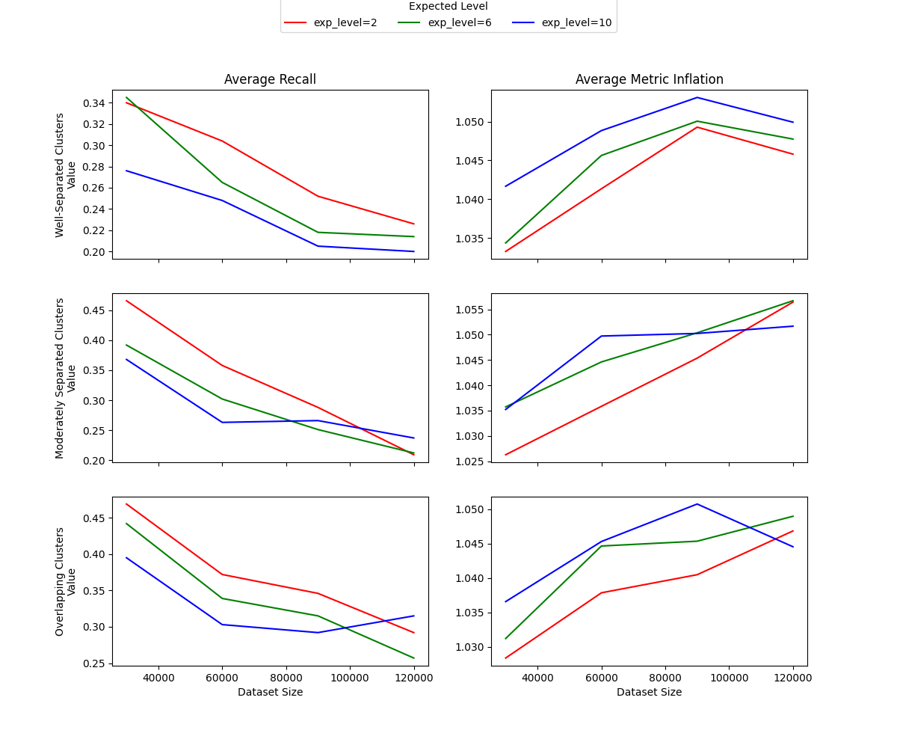

# Approximate Nearest Neighbor VectorStore

## Overview

This project implements a prototype **Approximate Nearest Neighbor (ANN)** data structure using a **layered graph**. The design is clearly inspired by hierarchical graph-based ANN methods such as HNSW, but the goal here is not to build a production-grade library.  Instead, this project is intended as a conceptual and experimental ANN implementation, suitable for study, benchmarking, and extension. 

## Key Features

- Layered graph ANN structure with geometric level assignment
- Supports cosine similarity and Euclidean distance
- Tunable search quality via `pool_factor`
- Separate neighbor budgets for upper and base layers
- Batch construction and incremental insertion
- Explicit component detection and MST-based reconnection
- Clean, readable implementation for experimentation

In particular, the project is meant to demonstrate:

- how a multi-level graph can accelerate nearest-neighbor search
- how search quality depends on graph density and candidate-pool size
- how design choices affect the tradeoff between speed and recall
- how one might keep a graph navigable even when disconnected components appear during construction

The code supports both **cosine similarity** and **Euclidean distance**, allows **batch construction** and **incremental insertion**, and includes explicit machinery for **component analysis and reconnection**. 

---

## Main Design Choices

### 1. Layered graph structure

Each stored vector is wrapped in a `VectorNode` object. A node stores:

- its numeric vector
- associated payload data
- optional source metadata
- an integer node id
- a maximum layer value
- the norm of the vector

The `VectorStore` organizes these nodes into a dictionary of adjacency lists, one graph per layer.

The central ANN idea is that not every point participates in every layer. Nodes are assigned a level using a **geometric distribution**:

```python
level = np.random.geometric(p=1/(self.exp_level+1)) - 1
```

Higher levels therefore contain fewer nodes, giving a sparse long-range navigation structure, while lower levels contain many more nodes and provide finer local search.

The parameter controlling this behavior is:

- `exp_level`: controls the expected height of a node

If `max_level` is not supplied, the implementation defaults to:

```python
max_level = 5 * exp_level
```

so extremely tall nodes are clipped. This keeps the hierarchy from growing too deep while still preserving the intended distributional behavior.

---

### 2. Metric abstraction

The implementation supports two metrics:

- `'cosine'`
- `'euclidean'`

Internally, both are handled through a common interface:

- cosine uses the normalized dot product
- Euclidean distance is internally converted into a similarity score by storing `-||x - y||`, allowing the search logic to treat all metrics uniformly as “maximize similarity”

This allows the search code to always treat “larger is better.” A corresponding `metric_multiplier` is then used when returning final results so that Euclidean values are reported back in ordinary positive distance units.

---

### 3. Top-layer setup and entry points

When the store is built in batch mode, the algorithm first identifies the nodes at the highest occupied layer and creates the top graph separately.

That top-layer construction does several important things:

1. it computes pairwise similarities among the top-layer nodes
2. it connects each node to its best neighbors
3. it symmetrizes those connections
4. it identifies weakly connected components
5. it selects representative entry nodes for search

The entry-point selection is especially important. Rather than forcing a single global entry node, the code chooses **medoid-like representatives** from each top-layer component. If additional entry points are allowed, it spreads them across components in a way that promotes coverage.

This gives the search routine multiple starting points and makes it more robust.

---

### 4. Controlled degree by layer

The graph uses separate neighbor budgets for the bottom layer and upper layers:

- `neighbors_bottom`: target degree at layer 0
- `neighbors_upper`: target degree at layers above 0

This is design choise is motivated by:

- the bottom layer is where final refinement happens, so it benefits from a larger neighborhood
- upper layers are mainly for navigation, so they can remain sparser

During both batch construction and incremental insertion, candidate neighbors are generated and then truncated to the appropriate final size.

---

### 5. Candidate-pool search via `pool_factor`

One of the most important parameters in the whole implementation is:

- `pool_factor`

This parameter controls how aggressively the algorithm explores the current graph before deciding which neighbors to keep.

During insertion, the code does **not** simply connect a new node to the first good node it finds. Instead, it builds a candidate pool by starting from a current best node, pulling in that node’s neighbors, ranking candidates by similarity, and continuing until a size budget is reached.

The candidate-pool budget is:

- `pool_factor * neighbors_upper` on upper layers
- `pool_factor * neighbors_bottom` on the base layer

After that, the pool is pruned down to the final allowed number of neighbors.

So `pool_factor` governs a major tradeoff:

- larger `pool_factor` -> more exploration, potentially better graph quality and better recall, but higher build/search cost
- smaller `pool_factor` -> faster operations, but a greater chance of missing strong neighbors

The same idea appears again during query-time search at layer 0, where the algorithm expands a candidate set of size approximately `k * pool_factor`.  In ANN terminology, this controls the breadth of the local search frontier.  

If you are benchmarking this project, `pool_factor` is one of the main knobs worth studying.

---

### 6. Batch construction

The intended primary workflow is batch construction via:

```python
build_vectorstore(doc_list)
```

The individual elements of doclist must be Python dictionaries of the form 

```python
{'vector':vec, 'data':data, 'source':source}
```

where the value associated to ```'vector'``` must be a numpy vector.  The value associate to ```'data'``` is the raw data producing the vector.   The ```'source'``` value is optional.  The method first converts the raw documents into `VectorNode` objects and then calls `build_from_VectorNodeList`.

The batch build process is roughly:

1. assign node ids and random maximum levels
2. determine the highest occupied layer
3. build the top layer
4. descend layer by layer, adding new nodes at each layer
5. analyze connected components on every layer (using a Kruskal-style MST procedure)
6. reconnect disconnected components afterward

This top-down build is important because each lower layer inherits the graph from the layer above, and then newly eligible nodes are inserted into that layer.

---

### 7. Incremental insertion

After a store has been built, new vectors can be inserted one at a time using:

```python
add_single_node(doc)
```

This method:

- assigns the new node a random level
- starts from the top-layer entry points
- greedily descends the structure
- builds candidate pools at each relevant layer
- connects the node to selected neighbors
- possibly updates those neighbors’ adjacency lists

This provides a dynamic-update path, though the most natural mode for experimentation is still batch construction.  Single entry does not guarantee the resulting structure is optimized as in the batch building process.  If a significant number of new nodes are added, rebuilding the vectorstore is recommended.

---

### 8. Component analysis and graph repair

A particularly interesting part of the implementation is that it does not simply assume each layer is connected.

Instead, it explicitly computes **weakly connected components** of each layer using `weak_component_analysis`.

If a layer has multiple components, the code then tries to reconnect them by:

1. sampling nodes from each component
2. scoring cross-component candidate edges
3. building a component-level edge list
4. selecting reconnection edges with a Kruskal-style MST procedure
5. adding a limited number of actual inter-component node links

This is a strong design choice for a prototype because it addresses a real ANN issue: a search graph that is locally reasonable can still perform poorly if parts of it are disconnected. Reconnecting components improves navigability without making the graph fully dense.

---

### 9. Greedy top-down query strategy

Search is performed with:

```python
find_neighbors(doc, k, pool_factor=None)
```

The query vector is wrapped in a temporary `VectorNode`, and the algorithm proceeds as follows:

1. evaluate the query against the entry points
2. choose the strongest few entry candidates
3. greedily descend from upper layers to the bottom layer
4. at layer 0, expand a candidate set by repeatedly exploring neighbors of the best unexpanded candidate
5. return the top `k` matches

This is exactly the kind of “coarse-to-fine” behavior that makes layered ANN methods effective.

The optional `pool_factor` argument lets query-time search be broader or narrower than the store default.

---

### 10. Readability and experimentation over heavy optimization

The code is written in a way that prioritizes transparency:

- adjacency lists are ordinary Python dictionaries
- nodes are explicit Python objects
- pairwise top-layer computations are done directly with NumPy
- component repair is implemented in a clear, inspectable way

That means this is well suited for:

- course or portfolio projects
- experimentation with ANN ideas
- measuring recall/speed tradeoffs
- comparing cosine and Euclidean behavior
- studying the effect of parameters such as `exp_level`, `neighbors_bottom`, `neighbors_upper`, and `pool_factor`

---

## Package Usage

## 1. Import the class

```python
from layered_graph_ann import VectorStore
```

---

## 2. Create a `VectorStore`

Example:

```python
vs = VectorStore(
    exp_level=2,
    neighbors_bottom=16,
    neighbors_upper=8,
    metric='cosine',
    pool_factor=5
)
```

### Constructor parameters

- `exp_level`  
  Controls the expected level of a node. Larger values tend to create taller hierarchies.

- `neighbors_bottom`  
  Number of neighbors to retain at the base layer.

- `neighbors_upper`  
  Number of neighbors to retain in upper layers.

- `max_level`  
  Optional cap on layer height. If omitted, the code uses `5 * exp_level`, with a small safeguard to keep it above `exp_level`.

- `metric`  
  Either `'cosine'` or `'euclidean'`.

- `pool_factor`  
  Controls the size of insertion and search candidate pools. This is one of the most important quality/speed parameters in the project.

---

## 3. Prepare the input data

The main build method expects a list of dictionaries. Each dictionary should have at least a vector:

```python
doc_list = [
    {'vector': [0.1, 0.2, 0.3], 'data': 'point A'},
    {'vector': [0.4, 0.5, 0.6], 'data': 'point B'},
    {'vector': [0.3, 0.1, 0.8], 'data': 'point C', 'source': 'example dataset'}
]
```

Supported fields are:

- `vector` (required): numeric array-like object
- `data` (optional): payload associated with the vector
- `source` (optional): metadata describing origin

The code converts these into `VectorNode` objects automatically.

---

## 4. Build the vector store

```python
vs.build_vectorstore(doc_list)
```

This is the recommended way to initialize the structure from raw data.

After building, the store contains:

- `vs.node_list`: the stored `VectorNode` objects
- `vs.layered_graph`: adjacency lists by layer
- `vs.entry_point`: top-layer entry nodes used in search
- `vs.component_info`: connected-component information by layer

---

## 5. Query the store

To retrieve approximate nearest neighbors:

```python
query = {'vector': [0.2, 0.15, 0.25]}
neighbors = vs.find_neighbors(query, k=3)
```

You may also override the default search breadth:

```python
neighbors = vs.find_neighbors(query, k=3, pool_factor=10)
```

This can improve recall at the cost of a slower search.

---

## 6. Read the results

The return value is a list of pairs of the form:

```python
[
    [VectorNode(...), score],
    [VectorNode(...), score],
    ...
]
```

Example:

```python
for node, score in neighbors:
    print("id:", node.id)
    print("score:", score)
    print("data:", node.data)
    print("source:", node.source)
    print()
```

Interpretation of `score`:

- for cosine similarity, larger scores are better
- for Euclidean distance, smaller returned values are better

---

## 7. Add a new vector after building

Once the store already exists, you can insert a new document:

```python
vs.add_single_node({
    'vector': [0.9, 0.1, 0.2],
    'data': 'new point',
    'source': 'streamed input'
})
```

This is only valid **after** an initial batch build. The code will raise an exception if you try to use single-node insertion on an empty store.

---

## 8. Inspect the store

A few useful helper methods are available.

### String summary

```python
print(vs)
```

This prints basic information such as occupancy, current top level, and metric type.

### Store size

```python
print(vs.store_size())
```

### Layer/component information

```python
vs.vector_store_layer_info()
```

This prints the number of components and the component sizes at each layer.

---

## 9. Minimal working example

```python
from layered_graph_ann import VectorStore

doc_list = [
    {'vector': [1.0, 0.0], 'data': 'A'},
    {'vector': [0.9, 0.1], 'data': 'B'},
    {'vector': [0.0, 1.0], 'data': 'C'},
    {'vector': [0.1, 0.9], 'data': 'D'}
]

vs = VectorStore(
    exp_level=2,
    neighbors_bottom=4,
    neighbors_upper=2,
    metric='cosine',
    pool_factor=5
)

vs.build_vectorstore(doc_list)

query = {'vector': [0.95, 0.05]}
neighbors = vs.find_neighbors(query, k=2)

for node, score in neighbors:
    print(node.id, node.data, score)
```

---

## 10. Notes and limitations

This package is best viewed as an educational and experimental ANN implementation rather than a fully optimized library.

A few things to keep in mind:

- top-layer construction uses explicit pairwise computations, so it is not tuned for massive-scale production use
- performance is shaped strongly by `pool_factor`, `neighbors_bottom`, `neighbors_upper`, and `exp_level`
- because the implementation is meant to be understandable, some parts favor clarity over micro-optimization

# Test Suites

The project includes two parallel test suites: one for **cosine similarity** and one for **Euclidean distance**. The two scripts are structurally the same, differing mainly in the metric used and in the way synthetic data are generated. The cosine version builds normalized cluster data on the unit sphere, while the Euclidean version uses an analogous setup in ordinary Euclidean space.

Each test suite is designed to study how the `VectorStore` behaves as several important parameters vary:

- **dimension** (`dim`)
- **dataset size**
- **expected layer height** (`exp_level`)
- **search breadth** (`pool_factor`)
- **cluster separation**

For each experimental condition, the script generates synthetic clustered data, builds a vector store, and compares ANN search against a brute-force baseline.

## Data generation

In the cosine test suite, the data consist of three Gaussian clusters whose centers lie at controlled angular separations. The three regimes are:

- `wide_clusters`
- `moderate_clusters`
- `close_clusters`

This makes it possible to test the ANN structure under increasingly difficult retrieval settings. Queries are generated from several locations distributed around and between the cluster centers, so the benchmark is not limited to only easy “near-center” queries.

## What is measured

For each parameter combination, the test suite records three main quantities:

- **build time**: time required to construct the vector store
- **brute-force query time**: average time for exact nearest-neighbor retrieval
- **ANN retrieval statistics**:
  - **recall**: fraction of true top-`k` neighbors recovered
  - **inflation**: ratio comparing brute-force average neighbor quality to ANN average neighbor quality
  - **query time**: average ANN search time

Together, these measurements show the central ANN tradeoff: faster query performance than brute force, at the cost of returning approximate rather than exact neighbors.

## Parameters explored

The cosine and Euclidean test suites both vary:

- dimensions from 5 up to 100
- dataset sizes from 30,000 up to 120,000 total points
- several values of `exp_level`
- several values of `pool_factor`

This allows the experiments to probe how search quality and runtime change as the graph becomes taller, denser, or more aggressively searched.

### Why these tests matter

These test suites were designed not just to confirm that the implementation runs, but to investigate how its design choices affect behavior. In particular, they make it possible to study:

- how increasing `pool_factor` improves recall while increasing search cost
- how `exp_level` affects graph structure and retrieval quality
- how performance changes with dimension and dataset size
- how much more difficult retrieval becomes as clusters move closer together

The Euclidean test suite mirrors the cosine test suite so that the same general conclusions can be compared across the two supported metrics.

## Experimental Results

Two parallel test suites were run: one using **cosine similarity** and one using **Euclidean distance**. In each case, synthetic clustered data were generated under three separation regimes:

- well-separated clusters
- moderately separated clusters
- overlapping clusters

The experiments varied:

- dataset size
- ambient dimension
- expected graph height (`exp_level`)
- search breadth (`pool_factor`)

For each parameter setting, ANN retrieval was compared against brute-force nearest-neighbor search. The main quantities recorded were:

- build time
- average retrieval time
- speedup relative to brute force
- recall
- average metric inflation

### Cosine Similarity

#### Build Time



Build time increases steadily with dataset size and also increases with `exp_level`, since taller hierarchies require more graph structure to be constructed.

#### Retrieval Time and Speedup





ANN retrieval is consistently much faster than brute force across all tested dimensions and cluster regimes. The observed speedups generally increase with dataset size.

#### Recall and Metric Inflation



As expected, increasing `pool_factor` improves recall and reduces average metric inflation, though at the cost of broader search. Lower-dimensional data were noticeably easier for this ANN structure, while higher-dimensional settings remained more challenging.

<details>
<summary>Additional cosine-similarity figures</summary>

#### Effect of `exp_level`



This figure isolates the effect of `exp_level` on recall and metric inflation.

</details>

### Euclidean Distance

#### Build Time



Build times for the Euclidean metric follow trends similar to the cosine case. Construction cost increases with dataset size and with `exp_level`, reflecting the additional work required to build deeper hierarchical structures. The dependence on cluster separation is minimal, as expected, since construction is driven primarily by graph connectivity rather than query difficulty.

#### Retrieval Time and Speedup





ANN retrieval remains significantly faster than brute-force search across all tested configurations. As with cosine similarity, the speedup increases with dataset size, highlighting the scalability advantage of the layered graph approach. Retrieval times are relatively stable across dimensions, indicating that the graph-based search effectively mitigates the curse of dimensionality in terms of runtime.

#### Recall and Metric Inflation



The same qualitative tradeoffs observed in the cosine setting appear here as well. Increasing `pool_factor` improves recall and reduces metric inflation, at the cost of increased search effort. As cluster separation decreases, retrieval becomes more difficult, leading to lower recall and higher inflation.

Compared to cosine similarity, Euclidean distance tends to produce slightly more uniform behavior across dimensions, though higher-dimensional settings still present a greater challenge for accurate retrieval.

<details>
<summary>Additional Euclidean-distance figures</summary>

#### Effect of `exp_level`



This figure isolates the effect of `exp_level` on recall and metric inflation. Larger values of `exp_level` generally improve navigability of the graph, though the gains are modest compared to increasing `pool_factor`, and come at a higher construction cost.

</details>
